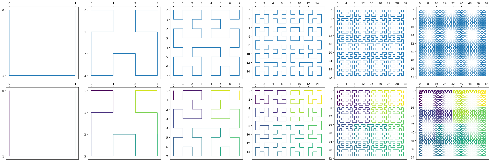
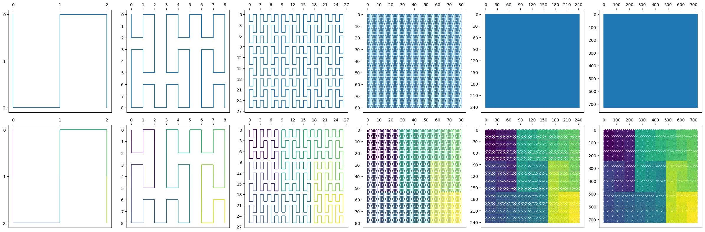
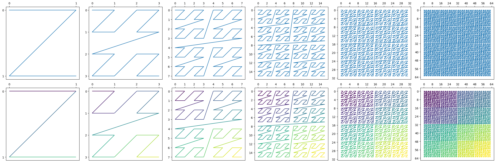
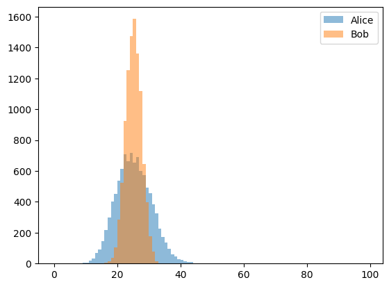
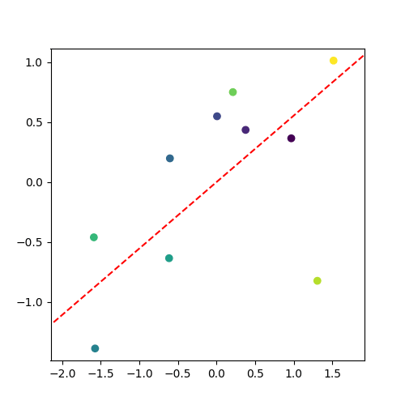
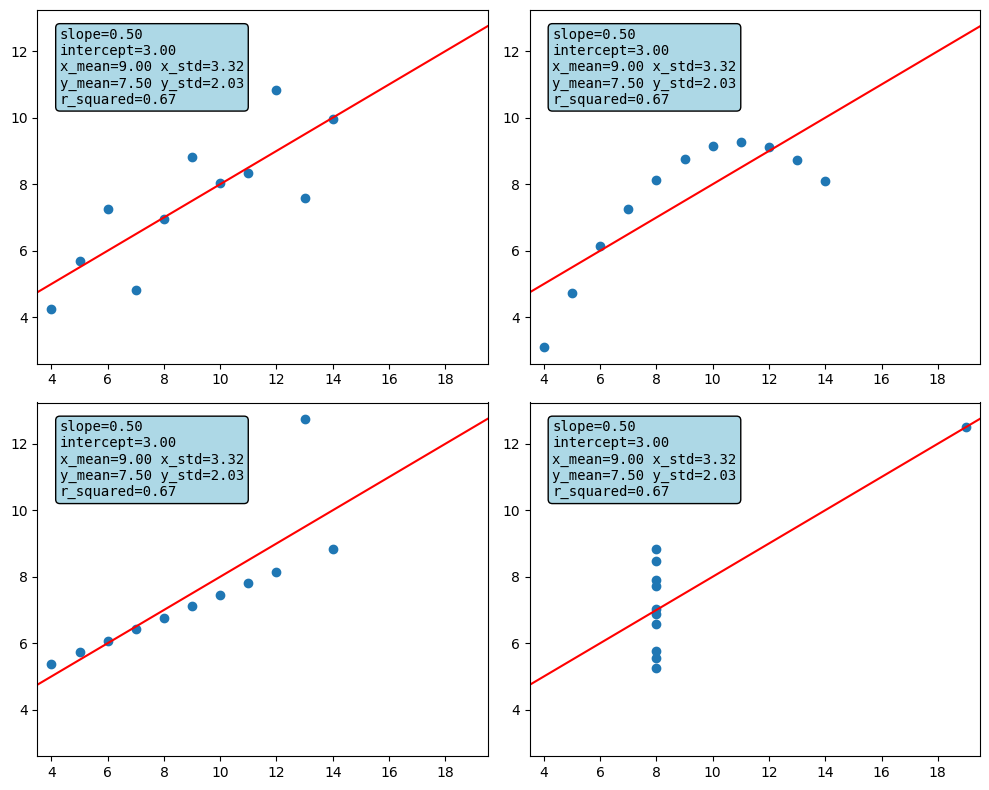
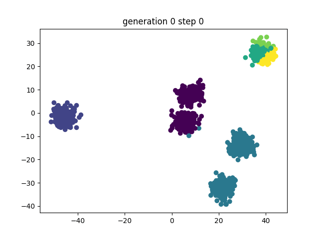
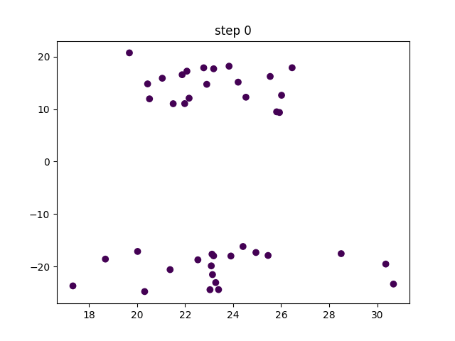
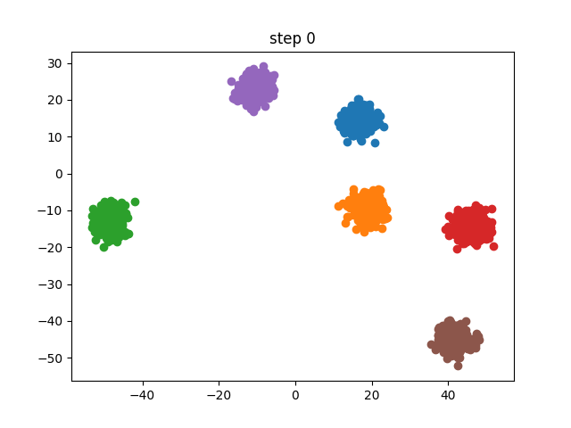

# MISC
Loose collection of miscellaneous scripts, tools, algos and exercises I've written while touching ML.

## space-filling curves

## coin toss

## PCA

## anscombe quartet

## clustering

